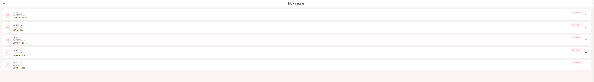

# Katrin's Cakes 🍰

> AI-powered dessert ordering assistant with intelligent chat interface


---

## 🚀 Quick Start

```bash
# Clone repository
git clone https://github.com/mariachizhikova08/se-toolkit-hackathon.git
cd se-toolkit-hackathon

# Set up environment
cp .env.example .env.docker.secret
# Edit .env.docker.secret with your API keys

# Start all services
docker compose --env-file .env.docker.secret up --build -d

# Open in browser
open http://localhost:42002
```

---

## 📸 Demo

### Main Catalog

*Beautiful pastel-themed catalog with real dessert photos, search, and filtering*

### AI Chat Assistant

*Conversational interface powered by Mistral AI for personalized recommendations*

### Shopping Cart

*Easy cart management with quantity controls*

### Order Tracking

*Track your orders with status updates and delivery information*

**Live Demo**: `http://localhost:42002` (after local deployment)

---

## 🎯 Product Context

### 👥 End Users
- **Customers**: People looking for delicious desserts with personalized recommendations
- **Bakery owners**: Small businesses needing an intelligent ordering system
- **Users with dietary restrictions**: People who need to filter by allergens (nuts, gluten, dairy)

### ❌ The Problem
Traditional dessert catalogs require manual browsing and don't provide:
- Personalized recommendations based on preferences
- Natural language search ("I want something chocolate without nuts")
- Intelligent assistance for customers with dietary restrictions
- Seamless ordering experience

### ✅ Our Solution
**Katrin's Cakes** is an AI-powered dessert platform that:
- 🤖 Understands natural language queries via Mistral AI
- 🔍 Provides smart search and filtering by ingredients, allergens, price
- 🛒 Enables conversational ordering through chat interface
- 📱 Works beautifully on mobile and desktop
- 🐳 Deploys in one command with Docker Compose

---

## ✨ Features

### Implemented ✅

| Feature | Description |
|---------|-------------|
| **Rich Product Catalog** | 13 desserts with high-quality photos, descriptions, prices, and categories |
| **Smart Search** | Filter by name, ingredients, category, price range |
| **AI Chat Assistant** | Mistral-powered conversational interface for recommendations and ordering |
| **Shopping Cart** | Add/remove items, quantity management, real-time total calculation |
| **Order Management** | Place orders with delivery address, track status, view order history |
| **Allergen Filtering** | Exclude nuts, gluten, dairy, and other allergens |
| **Responsive UI** | Beautiful pastel design with Playfair Display + Poppins fonts, works on all devices |
| **Docker Deployment** | One-command setup with Docker Compose (6 microservices) |
| **MCP Integration** | Model Context Protocol server for AI tool calling |

### Not Yet Implemented 🚧

| Feature | Priority | Notes |
|---------|----------|-------|
| User authentication | Medium | Accounts, login, order history per user |
| Payment integration | High | Stripe/YooKassa for online payments |
| Real-time notifications | Medium | SMS/email updates on order status |
| Admin panel | Low | Inventory management, analytics dashboard |
| Multi-language support | Low | Russian/English toggle |
| Customer reviews | Low | Ratings and feedback system |

---

## 🛠 Usage

### For Customers

#### 1. Browse the Catalog
- Open `http://localhost:42002`
- Scroll through dessert cards with photos
- Use category filters: Торты, Чизкейки, Выпечка, Десерты

#### 2. Search & Filter
- Type in search bar: "шоколад", "клубника", "без орехов"
- Results update in real-time

#### 3. Chat with AI Assistant 💬
Click the floating chat button and ask naturally:

```
👤: Посоветуй что-нибудь шоколадное без орехов
🤖: Вот варианты:
   • Чернолесье — 1800₽ (шоколадный бисквит, вишня)
   • Чизкейк Шоколадный — 1800₽ (без орехов)
   • Капкейк Шоколадный — 250₽
   Какой добавить в корзину?

👤: Добавь два капкейка
🤖: ✅ Добавила 2× Капкейк Шоколадный. Итого: 500₽. Оформляем?
```

#### 4. Place an Order
- Add items to cart
- Click 🛒 → "Оформить заказ"
- Fill in: name, phone, delivery address, comment
- Receive order confirmation with tracking ID

#### 5. Track Orders
- Open "Мои заказы" in the menu
- View status: pending → preparing → ready → delivered

### For Developers

#### Project Structure
```
se-toolkit-hackathon/
├── backend/              # FastAPI Python backend
│   ├── app/
│   │   ├── api/          # REST endpoints
│   │   ├── models/       # SQLAlchemy models
│   │   └── main.py       # App entry point
├── client/               # Flutter Web frontend
│   ├── lib/
│   │   ├── screens/      # UI pages
│   │   ├── widgets/      # Reusable components
│   │   └── services/     # API & WebSocket clients
├── mcp/                  # Model Context Protocol server
│   └── mcp-desserts/     # Dessert tools for AI
├── nanobot/              # AI agent with Mistral integration
├── docker-compose.yml    # Orchestration for 6 services
├── .env.docker.secret    # Environment variables (gitignored)
└── README.md             # This file
```

#### Key Commands
```bash
# Start all services
docker compose --env-file .env.docker.secret up --build -d

# View logs
docker compose logs -f [service_name]

# Stop services
docker compose down

# Rebuild specific service
docker compose up --build -d flutter-web

# Test API
curl http://localhost:8000/desserts/
curl http://localhost:8000/docs  # Swagger UI

# Test Flutter locally (without Docker)
cd client
flutter pub get
flutter run -d chrome
```

#### Environment Variables
Create `.env.docker.secret` from `.env.example`:

```env
# API Keys
LLM_API_KEY=your_mistral_api_key_here
QWEN_CODE_API_KEY=optional_qwen_key

# Database
POSTGRES_DB=desserts_db
POSTGRES_USER=user
POSTGRES_PASSWORD=secure_password

# Ports
BACKEND_HOST_PORT=8000
GATEWAY_HOST_PORT=42002
```

⚠️ **Never commit `.env.docker.secret` to version control!**

---

## 🚢 Deployment

### Requirements

**Operating System**: Ubuntu 24.04 LTS (recommended) or any Linux with Docker support

**Hardware**:
| Resource | Minimum | Recommended |
|----------|---------|-------------|
| CPU | 2 cores | 4 cores |
| RAM | 4 GB | 8 GB |
| Storage | 10 GB | 20 GB |
| Network | Public IP | Domain + SSL |

### What to Install on VM

```bash
# Update system
sudo apt update && sudo apt upgrade -y

# Install Docker (official method)
curl -fsSL https://get.docker.com -o get-docker.sh
sudo sh get-docker.sh
sudo usermod -aG docker $USER

# Install Docker Compose plugin
sudo apt install docker-compose-plugin -y

# Install Git
sudo apt install git -y

# Verify installation
docker --version          # Should show Docker 24+
docker compose version    # Should show Compose v2+
```

> 💡 **Important**: Log out and back in after adding user to docker group, or run `newgrp docker`.

### Step-by-Step Deployment

#### 1. Clone Repository
```bash
cd /opt
sudo git clone https://github.com/mariachizhikova08/se-toolkit-hackathon.git
cd se-toolkit-hackathon
sudo chown -R $USER:$USER .
```

#### 2. Configure Environment
```bash
# Copy example config
cp .env.example .env.docker.secret

# Edit with your values
nano .env.docker.secret
```

Required variables to set:
```env
LLM_API_KEY=your_actual_mistral_api_key
POSTGRES_PASSWORD=your_secure_password
```

#### 3. Set Permissions
```bash
chmod 600 .env.docker.secret
```

#### 4. Start Services
```bash
docker compose --env-file .env.docker.secret up --build -d
```

#### 5. Verify Deployment
```bash
# Check all services are running
docker compose ps

# Expected output:
# NAME                          STATUS
# ...-postgres-1                Up (healthy)
# ...-backend-1                 Up
# ...-flutter-web-1             Up
# ...-nanobot-1                 Up
# ...-mcp-desserts-1            Up
# ...-caddy-1                   Up

# Test API
curl http://localhost:8000/desserts/ | head -c 200

# Test frontend
curl -s -o /dev/null -w "%{http_code}" http://localhost:42002
# Should return: 200
```

#### 6. Configure Firewall (if enabled)
```bash
sudo ufw allow 42002/tcp  # Frontend
sudo ufw allow 8000/tcp   # API (optional, for debugging)
sudo ufw enable
```

#### 7. Access Application
- **Frontend**: `http://YOUR_VM_IP:42002`
- **API Docs**: `http://YOUR_VM_IP:8000/docs`
- **Health Check**: `http://YOUR_VM_IP:42002/health`

### Maintenance Commands

```bash
# View real-time logs
docker compose logs -f

# View logs for specific service
docker compose logs -f nanobot

# Restart all services
docker compose restart

# Update from repository and rebuild
git pull
docker compose down
docker compose up --build -d

# Stop services (keep data)
docker compose down

# Stop and remove all data (CAUTION!)
docker compose down -v

# Check disk usage
docker system df

# Clean up unused images
docker image prune -f
```

### Troubleshooting

| Issue | Solution |
|-------|----------|
| Services won't start | Check `docker compose logs [service]` for errors |
| API returns 500 | Verify database connection in backend logs |
| Frontend shows blank | Clear browser cache (Ctrl+Shift+R) or check Flutter build logs |
| AI not responding | Verify `LLM_API_KEY` is correct and has quota |
| Port already in use | Change ports in `docker-compose.yml` and `.env.docker.secret` |

---

## 🔧 Tech Stack

```
┌─────────────────────────────────────┐
│  Frontend: Flutter Web              │
│  • Dart, Provider, Google Fonts     │
│  • Responsive design, animations    │
└────────────┬────────────────────────┘
             │ HTTP / WebSocket
             ▼
┌─────────────────────────────────────┐
│  Backend: FastAPI (Python 3.11)     │
│  • SQLAlchemy, PostgreSQL           │
│  • REST API: /desserts, /orders     │
│  • CORS, Pydantic validation        │
└────────────┬────────────────────────┘
             │ MCP Protocol
             ▼
┌─────────────────────────────────────┐
│  AI Layer: Nanobot + Mistral API    │
│  • Natural language understanding   │
│  • Tool calling via MCP server      │
│  • Context-aware responses          │
└────────────┬────────────────────────┘
             │ Tool Execution
             ▼
┌─────────────────────────────────────┐
│  MCP Server: mcp-desserts           │
│  • list_desserts(), search()        │
│  • filter_by_ingredient()           │
│  • create_order(), get_status()     │
└─────────────────────────────────────┘
```

### Dependencies
| Component | Technology | Version |
|-----------|-----------|---------|
| Backend | Python, FastAPI, SQLAlchemy | 3.11, 0.111, 2.0 |
| Frontend | Flutter, Dart | 3.19, 3.3 |
| Database | PostgreSQL | 15-alpine |
| AI | Mistral API, Nanobot | latest |
| Infrastructure | Docker, Docker Compose | 24+, v2 |
| Proxy | Caddy / Nginx | 2-alpine |

---

## 🧪 Testing

### Manual Testing Checklist
- [ ] Catalog loads with 13 desserts and photos
- [ ] Search filters results by keyword
- [ ] Category filters work (Торты, Чизкейки, etc.)
- [ ] Adding to cart updates counter
- [ ] Cart shows correct total price
- [ ] Order form accepts name, phone, address
- [ ] Order confirmation shows tracking ID
- [ ] "My Orders" displays order history
- [ ] AI chat responds to "Посоветуй шоколадное"
- [ ] AI chat respects allergen filters
- [ ] Site is responsive on mobile width

### API Testing
```bash
# Get all desserts
curl http://localhost:8000/desserts/

# Search desserts
curl "http://localhost:8000/desserts/search?q=шоколад"

# Create order
curl -X POST http://localhost:8000/orders/ \
  -H "Content-Type: application/json" \
  -d '{
    "customer_name": "Test User",
    "phone": "+79990001122",
    "address": "Test Address",
    "items": [{"dessert_id": 1, "quantity": 2}]
  }'

# Get orders
curl http://localhost:8000/orders/
```

---

## 👥 Team

| Role | Name |
|------|------|
| Developer | Maria Chizhikova |
| Hackathon | SE Toolkit Hackathon 2026 |

---

## 📄 License

This project is licensed under the MIT License — see the [LICENSE](LICENSE) file for details.
```